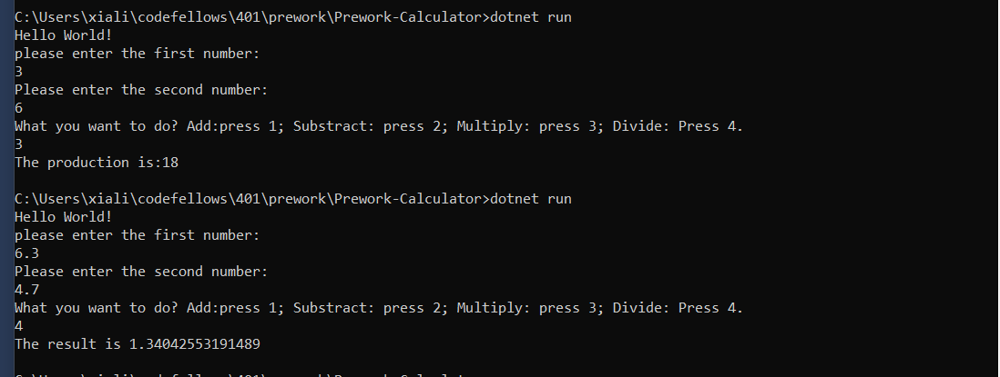

# Prework-Calculator-2-

 This is a very Basic Calculator,allow users to do simple operations between two numbers they enter

 1.Enter two numbers ;

2.Do the operations based on two numbers user type;

3.4 different operations:Add, Subtract, Multiply,Divide. 

4.User can choose what operation he/she wants in main menu.